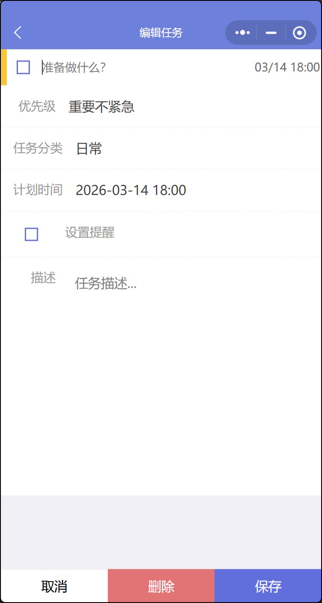

任务详情设计文档
当点击了任务列表中的任务，会跳转到任务详情页面，显示样式如图片中所示。

显示信息包括：
- 任务名称，在任务名称前面有一个复选框，用于标记任务是否已完成，可以点击复选框来切换任务的完成状态。
- 任务优先级：显示任务优先级，用下拉框选择，包括重要且紧急、重要但不紧急、不重要且紧急、不重要但不紧急四个选项。
- 任务分类：显示任务分类，用下拉框选择，包括无、用户设置的任务分类等选项。
- 任务截止时间：显示任务的截止时间，用日期选择器选择，包括年、月、日、时、分等。
- 任务周期: 
    - 如果任务有周期，会显示任务的周期：
        - 任务周期为每周重复时，会显示重复的具体日期，如每周一、每周三等。
        - 如果任务周期为每月重复时，会显示重复的具体日期，如每月1日、每月15日等。
    - 如果没有周期，可以选择是否设置周期：
        - 可以选择任务的周期，如每周重复、每月重复等。
        - 若选择周期为每周重复，还可以选择重复的具体日期，如每周一、每周三等；如果选择周期为每月重复，还可以选择重复的具体日期，如每月1日、每月15日等。
- 任务描述
- 设置提醒: 可以选择是否设置提醒，以及提醒时间。
在最下方会显示三个按钮：
- 取消：点击后会返回上一个界面。
- 删除任务：点击后会删除该任务。
- 保存任务：点击后会保存任务的修改。
当删除任务时，会弹出确认删除的弹窗，确认后会删除该任务。
当删除任务、保存任务后，先显示操作是否成功，成功后再返回上一个界面。
